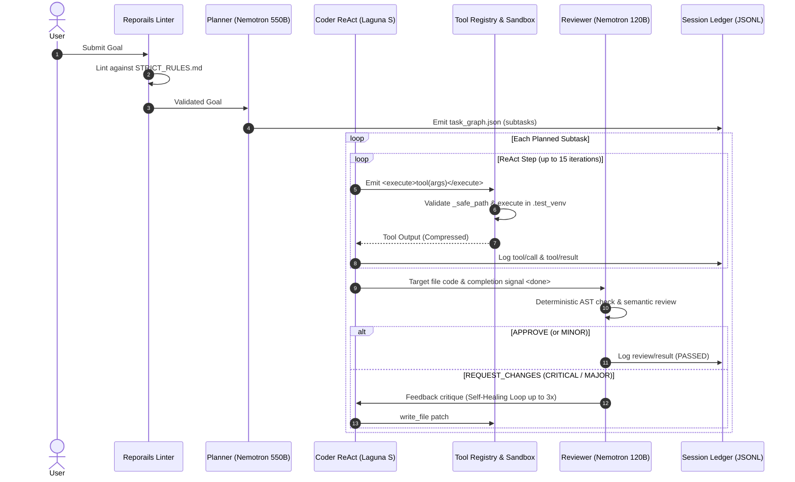

# SkillOpt Engine

SkillOpt Engine is a production-grade multi-agent coding harness and orchestration framework designed for Apple Silicon (macOS) and OpenRouter free-tier models. It combines heterogeneous role specialization, intelligent hot-swap failover (model cascading), resilient multi-grammar tool extraction, sandbox execution, and deterministic instruction governance.

---

## 🏛️ System Architecture

```
                               ┌──────────────────────────────────────────────┐
                               │           Multi-Agent Orchestrator           │
                               │              (orchestrator.py)               │
                               └──────────────────────┬───────────────────────┘
                                                      │
                       ┌──────────────────────────────┴──────────────────────────────┐
                       ▼                                                             ▼
         ┌───────────────────────────┐                                 ┌───────────────────────────┐
         │  Primary: Cloud API Mode  │                                 │   Fallback / Local Mode   │
         │       (OpenRouter)        │                                 │     (Apple MLX & Ollama)  │
         └─────────────┬─────────────┘                                 └─────────────┬─────────────┘
                       │                                                             │
        ┌──────────────┼──────────────┐                               ┌──────────────┴──────────────┐
        ▼              ▼              ▼                               ▼                             ▼
   ┌─────────┐    ┌─────────┐    ┌──────────┐                 ┌───────────────┐             ┌───────────────┐
   │ Planner │    │  Coder  │    │ Reviewer │                 │   Local MLX   │             │ Local Ollama  │
   │Nemotron │    │ Laguna  │    │ Nemotron │                 │  (Port 8801)  │             │ (Port 11434)  │
   │  550B   │    │  S 2.1  │    │120B Super│                 │Nanbeige 4.1 3B│             │   Ornith 9B   │
   └─────────┘    └─────────┘    └──────────┘                 └───────────────┘             └───────────────┘
```

---

## 🔍 Model Roles & Ground-Truth Configuration

### 1. Primary: Cloud API Mode (OpenRouter Free Tier)
When running in cloud mode (configured in `run_tests.sh`), the orchestrator partitions duties across specialized models:

| Agent Role | Model ID | Context | Description & Responsibility |
|---|---|---|---|
| **Planner** | `nvidia/nemotron-3-ultra-550b-a55b:free` | 1M tokens | High-level reasoning and task graph decomposition into JSON subtasks. |
| **Coder** | `poolside/laguna-s-2.1:free` | 262K tokens | Code generation and tool execution inside a 15-step iterative ReAct loop. |
| **Reviewer** | `nvidia/nemotron-3-super-120b-a12b:free` | 262K tokens | Severity-tiered code review (`CRITICAL`, `MAJOR`, `MINOR`, `RECOMMENDATION`). |

### 2. Local Fallback & Offline Engines (Apple Silicon)
- **Local MLX Server (`http://127.0.0.1:8801/v1`)**: Runs `mlx-community/Nanbeige4.1-3B-heretic-4bit` natively on Apple Silicon Metal GPU. Provides zero-latency hot-swap failover whenever cloud endpoints return `429 Too Many Requests` or `402 Payment Required`.
- **Local Ollama Server (`http://127.0.0.1:11434`)**: Hosts `ornith9b:latest` (6.5 GB) for offline development.

---

## 🔄 End-to-End Execution Lifecycle



---

## 🛠️ Core Harness Modules

### 1. Resilient Output Parsing (`core/output_extractor.py`)
LLMs often emit conversational preambles or messy formatting when asked for JSON. The 4-stage extractor ensures zero-crash parsing:
1. **Direct Parse**: `json.loads(text.strip())`
2. **Markdown Block Extraction**: Regex extraction from ` ```json ... ``` ` or ` ``` ... ``` ` blocks.
3. **Bracket Balance Counting**: State machine that tracks bracket depth while ignoring string literals and escapes.
4. **Scanning Decoder Fallback**: `json.JSONDecoder().raw_decode()` across all bracket positions.

### 2. Feedback-Driven Recovery & Plan Synthesis
- **Planner Retry Loop**: If a model generates malformed task graph output, the orchestrator re-prompts with explicit format instructions (up to 3 attempts).
- **Atomic Plan Synthesis**: If planner decomposition is exhausted, the harness synthesizes a 1-step atomic plan from the goal so the Coder agent can proceed immediately.
- **Multi-Turn Self-Healing**: Reviewer rejections trigger an iterative 3-turn repair cycle with the Coder rather than abandoning the task.

### 3. Tool Pipeline & Sandbox Execution (`sandbox/venv_executor.py`)
All actions run through a unified `ToolRegistry` with path traversal defense:
- **`run_command(cmd, is_daemon)` / `bash`**: Runs shell commands inside `.test_venv` with PTY support.
- **`manage_task(action, task_id)`**: Inspects or terminates background daemon tasks.
- **`write_file(path, content)`**: Atomically writes workspace files.
- **`replace_file_content(path, start_line, end_line, content)` / `edit_file`**: Surgically replaces 1-indexed line ranges.
- **`read_file(path)`**: Reads files with automatic head/tail truncation for large files (>4000 chars).
- **`list_dir(path)`**: Lists workspace directory structures.
- **`update_plan(new_tasks)`**: Dynamically updates remaining subtasks and synchronizes `Plans.md`.

### 4. Instruction Governance (`core/instruction_governance.py`)
Evaluates prompts against `STRICT_RULES.md` before execution:
- Blocks overly broad or ambiguous instructions.
- Enforces explicit file targeting.
- Flags destructive commands before they reach execution.

### 5. Append-Only Session Ledger (`core/session_ledger.py`)
Records all events into `runs/session_<id>.jsonl`:
- `goal/start`: Initial prompt and hyperparameters.
- `turn/start`, `step/start`: Subtask and ReAct step markers.
- `tool/call`, `tool/result`, `tool/error`: Complete tool inputs and outputs.
- `review/result`: Reviewer verdicts and critique feedback.

---

## 🚀 Quickstart & Setup

### Prerequisites
- macOS with Apple Silicon (M1/M2/M3/M4)
- Python 3.11+
- Virtual environment `tb-env`

### Installation & Execution
```bash
# 1. Clone repository
git clone https://github.com/adarrshpaul/skillopt-engine.git
cd skillopt-engine

# 2. Activate virtual environment
source tb-env/bin/activate

# 3. Install dependencies
pip install pytest psutil anyio python-dotenv faiss-cpu sentence-transformers

# 4. Set OpenRouter API Key (in .env or environment)
export OPENROUTER_API_KEY="sk-or-v1-..."

# 5. Run test runner
./run_tests.sh

# Or run orchestrator with custom goal
python3 -u orchestrator.py "Create a math helper utility in math_helper.py and verify with pytest"
```

---

## ⚙️ Environment Configuration

| Variable | Default | Description |
|---|---|---|
| `PLANNER_MODEL` | `nvidia/nemotron-3-ultra-550b-a55b:free` | Model used for task decomposition |
| `PLANNER_ENGINE` | `openrouter` | Engine for Planner (`openrouter`, `mlx`, `ollama`, `litellm`) |
| `PLANNER_URL` | `https://openrouter.ai/api/v1` | Endpoint URL for Planner |
| `CODER_MODEL` | `poolside/laguna-s-2.1:free` | Model used for coding and tool execution |
| `CODER_ENGINE` | `openrouter` | Engine for Coder |
| `CODER_URL` | `https://openrouter.ai/api/v1` | Endpoint URL for Coder |
| `REVIEWER_MODEL` | `nvidia/nemotron-3-super-120b-a12b:free` | Model used for code review |
| `REVIEWER_ENGINE` | `openrouter` | Engine for Reviewer |
| `REVIEWER_URL` | `https://openrouter.ai/api/v1` | Endpoint URL for Reviewer |
| `FALLBACK_MODEL` | `mlx-community/Nanbeige4.1-3B-heretic-4bit` | Local model for hot-swap failover |
| `FALLBACK_ENGINE` | `mlx` | Engine for fallback |
| `FALLBACK_URL` | `http://localhost:8801/v1` | Local MLX server URL |
| `OPENROUTER_API_KEY` | *(None)* | OpenRouter API authentication key |

---

## 🧪 Running Tests

```bash
# Run unit test suite across all core modules
pytest tests/ -v

# Run individual module tests
pytest tests/test_tool_pipeline.py
pytest tests/test_safety_gate.py
pytest tests/test_session_ledger.py
pytest tests/test_task_ledger.py
pytest tests/test_compaction.py
pytest tests/test_parallel_executor.py
```

---

## 📁 Repository Directory Map

```
├── orchestrator.py              # Main multi-agent ReAct orchestrator
├── model_router.py              # Role-to-endpoint routing registry
├── run_tests.sh                 # Test runner entrypoint
├── core/
│   ├── output_extractor.py      # Resilient JSON array and object extraction
│   ├── instruction_governance.py# Reporails-native goal linter
│   ├── session_ledger.py        # Append-only JSONL execution ledger
│   ├── task_ledger.py           # Markdown task state tracker (Plans.md)
│   ├── tool_pipeline.py         # Multi-grammar tool parsing engine
│   ├── safety_gate.py           # Command validation floor
│   ├── parallel_executor.py     # Concurrent tool execution engine
│   └── compaction.py            # Context window compaction governor
├── sandbox/
│   └── venv_executor.py         # PTY-based venv execution sandbox
├── tests/                       # Unit test suite for core modules
├── benchmark_free_models.py     # OpenRouter model evaluation suite
├── STRICT_RULES.md              # Instruction governance ruleset
└── SYSTEM_ARCHITECTURE.md       # Architectural deep-dive
```

---

## License
Apache 2.0
