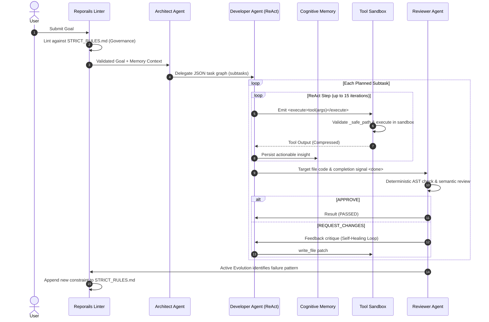

<div align="center">
  
# ⚡ SkillOpt Engine: The Multi-Agent Orchestrator

**Zero-Cost, Production-Grade AI Agent Orchestration with Active Instruction Governance.**

[](https://www.python.org/downloads/)
[](https://opensource.org/licenses/Apache-2.0)
[](https://ai.google.dev/)
[](https://mistral.ai/)
[](https://groq.com/)
[](#)

*SkillOpt Engine is a resilient multi-agent AI framework designed to prevent LLM instruction decay through deterministic governance, featuring a 5-tier hot-swap model cascade, Code Agent sandbox execution, CrewAI-inspired YAML configurations, and Cognitive Memory.*

---
</div>

## 🌟 Why SkillOpt? Defeating Instruction Decay

As AI agents scale in complexity, **instruction decay** becomes inevitable. Models forget system prompts, hallucinate APIs, and drift from their core directives. 

Inspired by concepts like [Active Instruction Governance](https://reporails.com/demo/see-why-ai-instructions-decay-then-write-ones-that-hold), the SkillOpt Engine introduces the **Reporails Linter Engine**. Before a single token is spent, goals are statically linted against mechanical rules in `STRICT_RULES.md`. If an agent begins to drift during a ReAct loop, the **Active Evolution Engine** detects the failure, synthesizes a new deterministic rule, and permanently patches the agent's behavior for all future runs.

---

## ✨ Key Architectural Innovations

- 🔄 **5-Tier Resilient Cascade:** Absolute uptime. If an API hits a rate limit (429) or high load (503), the engine automatically falls back: **Google Gemini API → Mistral API → Groq → OpenRouter → Local Apple Silicon (MLX)**. Includes rapid failover (max 2 retries) and intelligent exponential backoff.
- 🛡️ **Active Instruction Governance:** A self-improving linter that detects ReAct loop failures and synthesizes deterministic governance rules to prevent future instruction drift.
- 🗜️ **Two-Tier Context Compaction & Cognitive Memory:** Maximizes 1M+ token context windows (like Gemini Pro) with active eviction of stale tool payloads. The **Cognitive Memory** system persists cross-session insights to inject crucial context implicitly across runs.
- 👥 **CrewAI-Inspired Agent Configurations:** Fully declarative agent definitions in `config/agents.yaml`. Define distinct roles (Planner, Coder, Reviewer), backstories, and capability limits (max loops, specific tools) decoupled from the main orchestrator code.
- 🐍 **Code Agent Execution (`run_python`):** Empowers agents with "think-in-code" expressiveness inside the sandbox. Agents can run loops, complex logic, and data manipulations on the fly without extra ReAct loop round-trips.
- 🤝 **Task Delegation & Human-in-the-Loop (HITL):** Advanced multi-agent synergy via `delegate_task` allowing agents to spawn specialized subagents. Includes `ask_human` for graceful fallback to user intervention during ambiguous roadblocks.
- 🗺️ **Semantic LSP Navigation:** Escapes naive file dumping via Tree-Sitter AST def-ref graphs and LSP semantic tools (`find_definition`, `find_references`).
- 🔒 **Native Sandboxing:** Unified `ToolRegistry` with strict path traversal defenses and secure subprocess execution in isolated virtual environments (`venv_executor.py`).

---

## 🏛️ 5-Tier System Architecture & Routing

```text
                                  ┌──────────────────────────────────────────────┐
                                  │           Multi-Agent Orchestrator           │
                                  │              (orchestrator.py)               │
                                  └──────────────────────┬───────────────────────┘
                                                         │
   ┌──────────────────┬───────────────────┬──────────────┴───────────────┬───────────────────┬──────────────────┐
   ▼                  ▼                   ▼                              ▼                   ▼                  ▼
┌──────────┐      ┌──────────┐       ┌──────────┐                   ┌──────────┐        ┌──────────┐       ┌──────────┐
│  Tier 1  │      │  Tier 2  │       │  Tier 3  │                   │  Tier 4  │        │  Tier 5  │       │  Tier 5  │
│  Google  │ ───► │ Mistral  │ ────► │   Groq   │ ────────────────► │OpenRouter│ ─────► │Local MLX │       │ Local    │
│  Gemini  │ 429  │   API    │ 429   │  Cloud   │  429/402          │ (Poolside│ Error  │ (Apple   │       │ Ollama   │
└──────────┘      └──────────┘       └──────────┘                   └──────────┘        └──────────┘       └──────────┘
```

### 🧠 Heterogeneous Agent Roles (`config/agents.yaml`)

The orchestrator parses `config/agents.yaml` dynamically to route subtasks to specialized AI agents:

| Agent Role | Responsibility | Engine Preference |
|---|---|---|
| **Architect** | High-level reasoning, system design, and JSON subtask decomposition (Planner). | `google` |
| **Developer** | Raw code generation and deterministic tool execution inside a 15-step ReAct loop (Coder). | `groq` / `google` |
| **Reviewer** | AST semantic review and triggering multi-turn ReAct self-healing cycles. | `mistral` |
| **Researcher** | Read-only investigation and web searching. | `openrouter` |

---

## 🛠️ Complete Tool Inventory (`ToolRegistry`)

Agents execute actions inside the sandbox using structured `<execute>` tags:

1. **`run_python(code)`**: Write and execute raw Python scripts in the sandbox for loops, calculations, and complex logic.
2. **`run_command(cmd, is_daemon=False)`**: Run arbitrary shell commands with background daemon support.
3. **`write_file(path, content)`**: Create or overwrite files safely within workspace boundaries.
4. **`replace_file_content(path, start_line, end_line, content)`**: Surgical line-range file edits.
5. **`read_file(path)`**: Read file content with smart truncation guards.
6. **`list_dir(path)`**: List directory contents.
7. **`find_definition(symbol, file_path=None)`**: Jump to symbol definitions via Tree-Sitter AST / LSP.
8. **`find_references(symbol, file_path=None)`**: Locate all callers and references across the project.
9. **`document_symbols(path)`**: Generate AST outlines of classes, functions, and methods.
10. **`hover(symbol, file_path=None)`**: View type signatures, docstrings, and locations.
11. **`delegate_task(role, task)`**: Delegate sub-tasks to specialized sub-agents.
12. **`ask_human(question)`**: Request human feedback or clarification with fallback for non-interactive modes.
13. **`update_plan(new_tasks)`**: Dynamically adjust remaining tasks in the execution plan.
14. **`manage_task(action, task_id)`**: Inspect or terminate background daemon tasks.

---

## 🔄 End-to-End Execution Lifecycle



---

## ⚠️ Current Architecture & Missing Integrations

While SkillOpt encompasses a massive suite of Apple Silicon local model features, there is currently an architectural split:

- **Dual-Layer Activation Steering (`steer_server.py`)**: The project features a native PyTorch HTTP inference server on Port 8800 that applies Compiled Contrastive Activation Addition (CAA) steering vectors to local MLX models.
- **Missing Integration**: The cloud orchestration loop (`orchestrator.py`) **does not yet apply these steering vectors** to cloud providers (Google, Mistral, Groq), as CAA requires direct access to residual streams. The 5-Tier cascade currently relies entirely on prompt-based Active Instruction Governance for cloud models. 

---

## 🚀 Quickstart & Setup

### Prerequisites
- macOS with Apple Silicon (M1/M2/M3/M4) recommended for Local MLX Fallback.
- Python 3.11+

### Installation

```bash
# 1. Clone repository
git clone https://github.com/adarrshpaul/skillopt-engine.git
cd skillopt-engine

# 2. Activate virtual environment
python3 -m venv tb-env
source tb-env/bin/activate

# 3. Install dependencies
pip install pytest psutil anyio python-dotenv faiss-cpu sentence-transformers pyyaml
```

### Configuration

Create a `.env` file in the root directory and supply your API keys for the cascade tiers:

```env
# API Keys for the 5-Tier Cascade
GOOGLE_API_KEY="your-gemini-key"
MISTRAL_API_KEY="your-mistral-key"
GROQ_API_KEY="your-groq-key"
OPENROUTER_API_KEY="your-openrouter-key"

# Routing Defaults
PLANNER_ENGINE="google"
CODER_ENGINE="groq"
REVIEWER_ENGINE="mistral"
```

*Note: The orchestrator features a zero-dependency `.env` loader fallback at the entry point.*

### Execution

Run the orchestrator with any goal:

```bash
python3 -u orchestrator.py "Create a web-based Kanban board using FastAPI and Vanilla JS. Write a complete pytest suite."
```

## 🧪 Running Tests

```bash
# Run unit test suite across all 20 core module tests
python3 -m pytest tests/test_rigorous_validation.py -v
```

---
<div align="center">
  <p><i>Engineered for the Open-Source Agentic Future to defeat LLM Instruction Decay.</i></p>
  <p>Apache 2.0 License</p>
</div>
