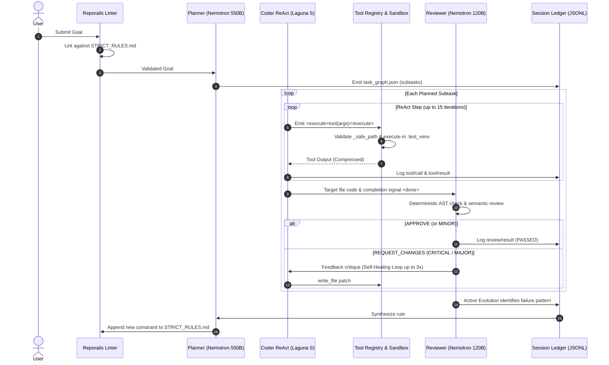

<div align="center">
  
# ⚡ SkillOpt Engine 2.0

**Zero-Cost, Production-Grade Agentic Orchestration on Apple Silicon.**

[](https://www.python.org/downloads/)
[](https://opensource.org/licenses/Apache-2.0)
[](https://openrouter.ai/)
[](#)

*SkillOpt Engine combines heterogeneous role specialization, intelligent hot-swap failover, resilient multi-grammar tool extraction, sandbox execution, and deterministic instruction governance to build the most robust ReAct loops at zero cost.*

---
</div>

## ✨ Key Architectural Innovations

- 🔄 **Native Cloud-to-Local Cascading:** Instantly failover from OpenRouter (`429 Too Many Requests`) to local Apple Silicon MLX models (e.g., Nanbeige 3B) without dropping task state.
- 🛡️ **Active Instruction Evolution:** A self-improving engine that analyzes the ReAct session ledger for Reviewer rejections and dynamically synthesizes deterministic governance rules into `STRICT_RULES.md`.
- 🗜️ **Two-Tier Context Compaction:** Maintains strict token budgets with Tier 1 in-loop tool result eviction and Tier 2 structured 5-section context distillation checkpoints.
- 🗺️ **Semantic LSP Navigation:** Escapes naive file dumping via Tree-Sitter AST def-ref graphs and LSP semantic tools (`find_definition`, `find_references`).
- ⚖️ **Deterministic Governance:** Reporails-native linting evaluates user intent against mechanical rules *before* spending tokens.

---

## 🏛️ System Architecture

```text
                               ┌──────────────────────────────────────────────┐
                               │           Multi-Agent Orchestrator           │
                               │              (orchestrator.py)               │
                               └──────────────────────┬───────────────────────┘
                                                      │
                       ┌──────────────────────────────┴──────────────────────────────┐
                       ▼                                                             ▼
         ┌───────────────────────────┐                                 ┌───────────────────────────┐
         │  Primary: Cloud API Mode  │                                 │   Fallback / Local Mode   │
         │       (OpenRouter)        │                                 │     (Apple MLX & Ollama)  │
         └─────────────┬─────────────┘                                 └─────────────┬─────────────┘
                       │                                                             │
        ┌──────────────┼──────────────┐                               ┌──────────────┴──────────────┐
        ▼              ▼              ▼                               ▼                             ▼
   ┌─────────┐    ┌─────────┐    ┌──────────┐                 ┌───────────────┐             ┌───────────────┐
   │ Planner │    │  Coder  │    │ Reviewer │                 │   Local MLX   │             │ Local Ollama  │
   │Nemotron │    │ Laguna  │    │ Nemotron │                 │  (Port 8801)  │             │ (Port 11434)  │
   │  550B   │    │  S 2.1  │    │120B Super│                 │Nanbeige 4.1 3B│             │   Ornith 9B   │
   └─────────┘    └─────────┘    └──────────┘                 └───────────────┘             └───────────────┘
```

### 🧠 Model Roles

When running in primary cloud mode, the orchestrator partitions duties across specialized free-tier models:

| Agent Role | Recommended Model | Responsibility |
|---|---|---|
| **Planner** | `nvidia/nemotron-3-ultra-550b-a55b:free` | High-level reasoning and task graph decomposition into JSON subtasks. |
| **Coder** | `poolside/laguna-s-2.1:free` | Code generation and tool execution inside a 15-step iterative ReAct loop. |
| **Reviewer** | `nvidia/nemotron-3-super-120b-a12b:free` | Severity-tiered code review and multi-turn ReAct self-healing feedback. |

---

## 🔄 End-to-End Execution Lifecycle



---

## 🛠️ Core Harness Modules

### 1. Resilient Output Parsing (`core/output_extractor.py`)
LLMs often emit conversational preambles or messy formatting when asked for JSON. Our 4-stage extractor ensures zero-crash parsing via bracket balance counting state machines.

### 2. Feedback-Driven Recovery & Plan Synthesis
- **Planner Retry Loop**: If a model generates malformed task graph output, the orchestrator re-prompts with explicit format instructions.
- **Multi-Turn Self-Healing**: Reviewer rejections trigger an iterative 3-turn repair cycle with the Coder rather than abandoning the task.

### 3. Tree-Sitter & AST Static Repo Map (`core/symbol_index.py`)
Analyzes call frequencies across classes, functions, and imports to generate a token-budgeted architectural outline (≤1,000 tokens) injected into the Planner and Coder context upfront.

### 4. Tool Pipeline & Sandbox Execution (`sandbox/venv_executor.py`)
13 powerful actions run through a unified `ToolRegistry` with path traversal defense, including `find_definition`, `find_references`, `run_command`, `write_file`, and `update_plan`.

### 5. Append-Only Session Ledger (`core/session_ledger.py`)
Records all events into `runs/session_<id>.jsonl` with deterministic context replay.

---

## ⚖️ Honest Benchmark Comparison

| Architectural Feature | SkillOpt Engine | Claude Code Harness | DeepSeek Harness |
|---|---|---|---|
| **Heterogeneous Model Cascading** | ✅ **Native Cloud-to-Local** | ❌ Single-vendor (Claude) | ❌ Single-model |
| **Hardware Cost & Accessibility** | ✅ **$0 / Zero-Cost** (Apple Silicon) | ❌ High API cost | ❌ High GPU VRAM needed |
| **Instruction Governance** | ✅ **Active Evolution & Linting** | ⚠️ Post-hoc prompt guardrails | ⚠️ Basic system prompts |
| **Telemetry Ledger** | ✅ **Deterministic JSONL Replay** | ✅ Full session replay | ✅ Trajectory rollout logging |
| **Context Window Compaction** | ✅ **Two-Tier In-Loop Compactor** | ✅ Dynamic Sliding-Window | ⚠️ Chunked trajectory truncation |
| **Codebase Indexing** | ✅ **Tree-Sitter / AST Def-Ref Graph** | ✅ Full LSP, AST Indexing | ✅ Tree-sitter AST Graph Search |

---

## 🚀 Quickstart & Setup

### Prerequisites
- macOS with Apple Silicon (M1/M2/M3/M4)
- Python 3.11+
- Virtual environment `tb-env`

### Installation & Execution
```bash
# 1. Clone repository
git clone https://github.com/adarrshpaul/skillopt-engine.git
cd skillopt-engine

# 2. Activate virtual environment
source tb-env/bin/activate

# 3. Install dependencies
pip install pytest psutil anyio python-dotenv faiss-cpu sentence-transformers

# 4. Set OpenRouter API Key (in .env or environment)
export OPENROUTER_API_KEY="sk-or-v1-..."

# 5. Run orchestrator with custom goal
python3 -u orchestrator.py "Create a math helper utility in math_helper.py and verify with pytest"
```

## 🧪 Running Tests

```bash
# Run unit test suite across all core modules
pytest tests/ -v
```

---
<div align="center">
  <p><i>Engineered for the Open-Source Agentic Future.</i></p>
  <p>Apache 2.0 License</p>
</div>
